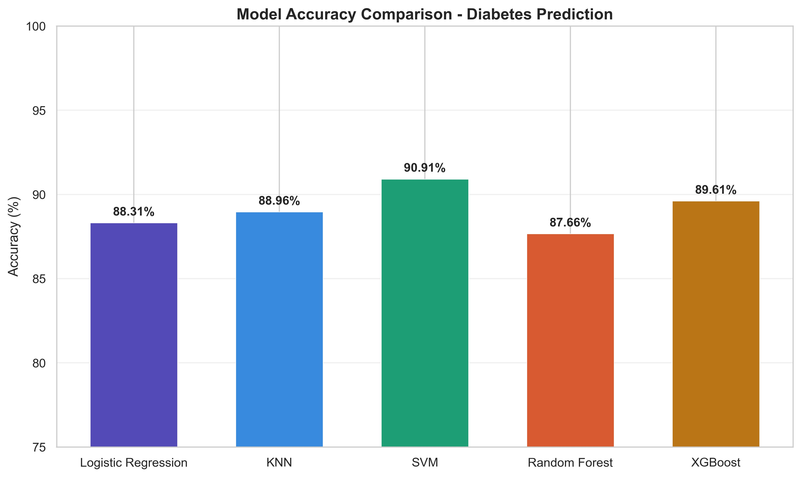
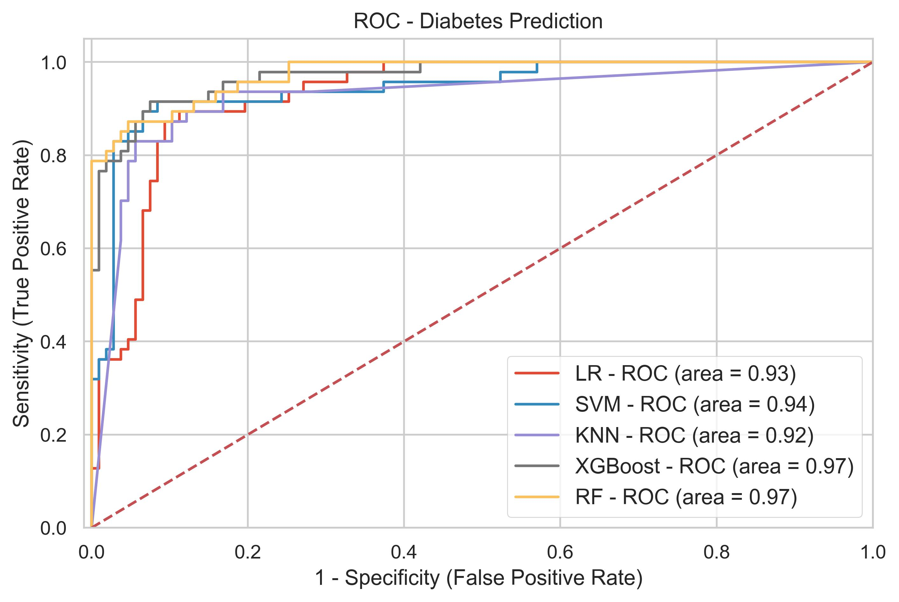

# Diabetes Prediction — Comparative ML Model Analysis

Predicting the onset of diabetes on the Pima Indians Diabetes dataset by benchmarking five supervised classifiers under a common preprocessing and evaluation pipeline.

## Results

| Model               | Accuracy | Recall | F1     | Precision | ROC-AUC |
|---------------------|:--------:|:------:|:------:|:---------:|:-------:|
| SVM (RBF)           | **90.9%**| 91.5%  | 86.0%  | 81.1%     | 94.5%   |
| XGBoost             | 89.6%    | 91.5%  | 84.3%  | 78.2%     | 97.0%   |
| KNN                 | 89.0%    | 87.2%  | 82.8%  | 78.8%     | 92.4%   |
| Logistic Regression | 88.3%    | 89.4%  | 82.3%  | 76.4%     | 93.0%   |
| Random Forest       | 87.7%    | 89.4%  | 81.5%  | 75.0%     | 97.4%   |

*Test set: 154 samples, stratified 80/20 split, random_state=0.*




## Dataset

- **Source:** [Pima Indians Diabetes Database](https://www.kaggle.com/datasets/uciml/pima-indians-diabetes-database)
- **Rows:** 768 female patients (≥ 21 y/o, Pima Indian heritage)
- **Features:** Pregnancies, Glucose, Blood Pressure, Skin Thickness, Insulin, BMI, Diabetes Pedigree Function, Age
- **Target:** `Outcome` (0 = healthy, 1 = diabetic)

## Pipeline

1. **EDA** — distributions, correlations, class-balance checks (34.9% positive).
2. **Missing values** — zero-values in Glucose / BloodPressure / SkinThickness / Insulin / BMI treated as missing, then imputed with class-conditional medians.
3. **Outliers** — winsorised at IQR fences (clipped, not dropped).
4. **Feature engineering** — categorical bins for BMI, Insulin, and Glucose (one-hot encoded).
5. **Scaling** — `StandardScaler` on train, transform on test.
6. **Class imbalance** — SMOTE (k=5) on the training set only.
7. **Feature selection** — Random Forest mean-importance threshold (`SelectFromModel`).
8. **Hyperparameter tuning** — `GridSearchCV` with stratified K-fold.
9. **Evaluation** — accuracy, precision, recall, F1, ROC-AUC, confusion matrices.

## Setup

Requires Python 3.9+.

```bash
git clone https://github.com/Saad-Byte345/diabetes-prediction.git
cd diabetes-prediction
python -m venv .venv
# Windows: .venv\Scripts\activate     | Unix: source .venv/bin/activate
pip install -r requirements.txt
jupyter notebook "ML_Project (1).ipynb"
```

Then Run All from the top.

## Repository layout

```
.
├── ML_Project (1).ipynb            main notebook (EDA → preprocessing → training → eval)
├── diabetes.csv                    dataset (768 × 9)
├── requirements.txt
├── README.md
├── LICENSE
└── *.jpeg                          generated figures (ROC, confusion matrices, comparisons)
```

## Tech stack

Python · pandas · NumPy · scikit-learn · XGBoost · imbalanced-learn (SMOTE) · seaborn · matplotlib · Jupyter

## License

MIT — see [LICENSE](LICENSE).
